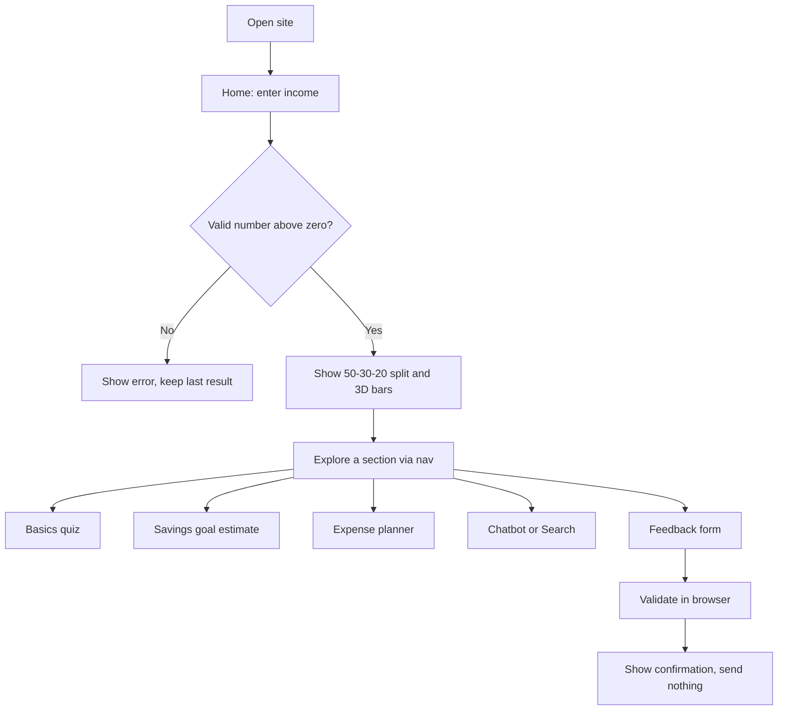
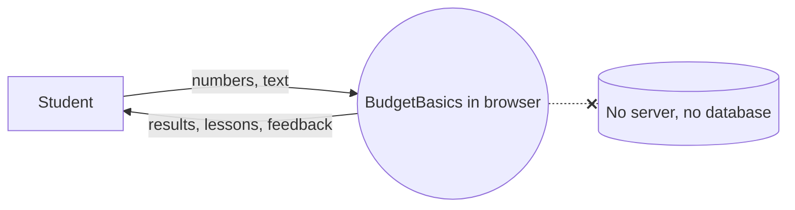

# BudgetBasics Project Report

## 1. Purpose
A safe, private simulator that teaches students and beginners budgeting basics before they manage real money.

## 2. Scope
12 sections: Home, Basics, Needs vs wants, 50-30-20, Savings goals, Expense planner, Money mistakes, Gallery, Chatbot, Search, Feedback, About (with Contact and Sitemap).

## 3. Architecture
Single-page site. A hash router shows one section at a time and moves focus to the main region for screen readers. All state lives in JavaScript variables.

## 4. Flowchart (typical session)

## 5. Data flow (level 0)

## 6. Formulas
- Needs = income x 0.50, Wants = income x 0.30, Savings = income x 0.20
- Months to goal = ceil((target - saved) / monthly)
- Balance = sample budget - sum of expenses

## 7. Validation rules
Reject empty, negative, non-numeric, zero (where a positive value is needed) and values above 1,000,000,000. Commas are allowed. Errors are announced through ARIA live regions and never clear the last valid result silently.

## 8. Testing
See `test-data.json`. Manual checklist: every nav link, every input rule above, keyboard-only use, mobile, tablet and desktop widths, light and dark themes, reduced motion. Run Lighthouse in Chrome DevTools and record Performance, Accessibility and SEO scores.

## 9. Privacy and safety
No accounts, no bank data, no cookies, no storage, no data transmission. Contact details ask users never to share bank information.

## 10. Limitations
The chatbot is rule-based keyword matching, not a language model. The Three.js scene and fonts load from public CDNs. The demo video and Word user manual are not included.
